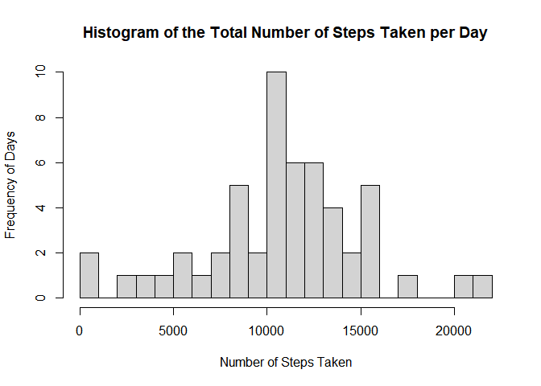
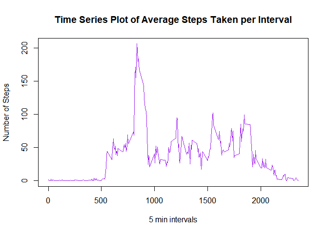
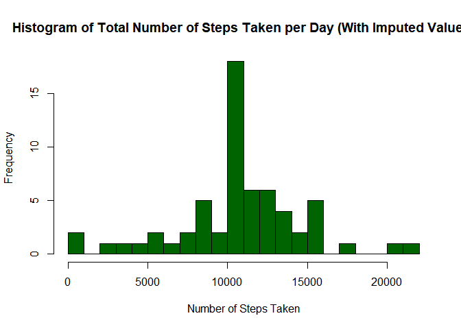
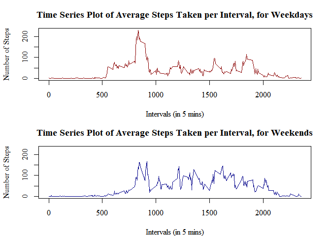

## Loading and preprocessing the data


```r
initialData <- read.csv("activity.csv")
```

Load the activity monitoring data covering the steps taken between October and November of 2012. Preview the first few lines of the data.


```r
head(initialData)
```

```
##   steps       date interval
## 1    NA 2012-10-01        0
## 2    NA 2012-10-01        5
## 3    NA 2012-10-01       10
## 4    NA 2012-10-01       15
## 5    NA 2012-10-01       20
## 6    NA 2012-10-01       25
```

```r
str(initialData)
```

```
## 'data.frame':	17568 obs. of  3 variables:
##  $ steps   : int  NA NA NA NA NA NA NA NA NA NA ...
##  $ date    : chr  "2012-10-01" "2012-10-01" "2012-10-01" "2012-10-01" ...
##  $ interval: int  0 5 10 15 20 25 30 35 40 45 ...
```


## What is mean total number of steps taken per day?


```r
data <- initialData
totalStepsDay <- aggregate(steps ~ date, data, sum)
head(totalStepsDay)
```

```
##         date steps
## 1 2012-10-02   126
## 2 2012-10-03 11352
## 3 2012-10-04 12116
## 4 2012-10-05 13294
## 5 2012-10-06 15420
## 6 2012-10-07 11015
```

Histogram of steps. NA's are not removed.


```r
hist(totalStepsDay$steps, breaks=20, ylab="Frequency of Days", xlab="Number of Steps Taken", main="Histogram of the Total Number of Steps Taken per Day")
```

<!-- -->

With a summary of the mean and median values of the total number of steps taken per day.


```r
library(dplyr)
```

```
## Warning: package 'dplyr' was built under R version 4.3.3
```

```r
totalStepsSummary <- summarise(totalStepsDay, meanOfTotalSteps=mean(totalStepsDay$steps),
                               medianOfTotalSteps=median(totalStepsDay$steps))
print(totalStepsSummary)
```

```
##   meanOfTotalSteps medianOfTotalSteps
## 1         10766.19              10765
```

The mean value calculated is 'meanOfTotalSteps', and the median value 'medianOfTotalSteps'.


## What is the average daily activity pattern?

This section will look at the daily activity pattern.


```r
meanStepsInterval <- aggregate(steps ~ interval, data, mean)
head(meanStepsInterval)
```

```
##   interval     steps
## 1        0 1.7169811
## 2        5 0.3396226
## 3       10 0.1320755
## 4       15 0.1509434
## 5       20 0.0754717
## 6       25 2.0943396
```

The base R plotting system is used to create a time series plot, with each interval on the x axis, and the average steps data on the y axis.


```r
plot(x=meanStepsInterval$interval, y=meanStepsInterval$steps, type="l",
     main="Time Series Plot of Average Steps Taken per Interval",
     ylab="Number of Steps", xlab="5 min intervals",
     col="purple")
```

<!-- -->

The maximum number of steps seems to happen before 1000 mins and sometime after 750mins.


```r
meanStepsInterval[grep(max(meanStepsInterval$steps), meanStepsInterval$steps), ]
```

```
##     interval    steps
## 104      835 206.1698
```

More specifically, the maximum number of steps happened 'meanStepsInterval$steps' minutes after October 1st, 2012.


## Imputing missing values

The data contains some NA values, as we see below:


```r
anyNA(initialData)
```

```
## [1] TRUE
```
Count the number of NAs in each column.


```r
data.frame(steps=sum(is.na(initialData$steps)), 
           interval=sum(is.na(initialData$interval)), 
           date=sum(is.na(initialData$date)))
```

```
##   steps interval date
## 1  2304        0    0
```

All of the NA values are contained within the steps variable. There are a total of 2304 NA in the steps.

The strategy to deals with all the NAs is to replace all of these missing values with a mean value for the same interval, averaged across all days. A for loop is used to achieve this. 


```r
imputedData <- initialData
for(x in 1:17568) {
    if(is.na(imputedData[x, 1])==TRUE) {
        imputedData[x, 1] <- meanStepsInterval[meanStepsInterval$interval %in% imputedData[x, 3], 2]
    }
}
head(imputedData)
```

```
##       steps       date interval
## 1 1.7169811 2012-10-01        0
## 2 0.3396226 2012-10-01        5
## 3 0.1320755 2012-10-01       10
## 4 0.1509434 2012-10-01       15
## 5 0.0754717 2012-10-01       20
## 6 2.0943396 2012-10-01       25
```

After the NAs have been fixed, a new histogram can be made. 


```r
imputedTotalStepsDay <- aggregate(steps ~ date, imputedData, sum)
head(imputedTotalStepsDay)
```

```
##         date    steps
## 1 2012-10-01 10766.19
## 2 2012-10-02   126.00
## 3 2012-10-03 11352.00
## 4 2012-10-04 12116.00
## 5 2012-10-05 13294.00
## 6 2012-10-06 15420.00
```

Creating the histogram:


```r
paletteRed <- colorRampPalette(c("darkgreen"))
hist(imputedTotalStepsDay$steps, breaks=20, xlab="Number of Steps Taken", 
     main="Histogram of Total Number of Steps Taken per Day (With Imputed Values)",
     col=paletteRed(22))
```

<!-- -->

And update the means and medians:


```r
imputedStepsSummary <- summarise(imputedTotalStepsDay, 
                                 meanOfTotalSteps=mean(imputedTotalStepsDay$steps), 
                                 medianOfTotalSteps=median(imputedTotalStepsDay$steps))  
print(imputedStepsSummary)
```

```
##   meanOfTotalSteps medianOfTotalSteps
## 1         10766.19           10766.19
```
Compared to the previous counts, the values haven't changed.Removing the Nas had more of a benefit to producing the histogram.


### Are there differences in activity patterns between weekdays and weekends?

Using the imputed data set, a new variable is created to capture whether each day is a "weekday" or a "weekend".

Using the weekdays function to calculate this factor, a for loop assigned the factor value "weekend" to all rows it read as having the values "Saturday" or "Sunday", and assign "weekday" to the others.


```r
daysData <- imputedData
daysData$days <- weekdays(as.Date(daysData$date))
daysData$weekday <- as.character(rep(0, times=17568))
for(x in 1:17568) {
    if(daysData[x, 4] %in% c("Saturday", "Sunday")) {
        daysData[x, 5] <- "weekend"
    } else {
        daysData[x, 5] <- "weekday"
    }
}
daysData$weekday <- factor(daysData$weekday)
head(daysData)
```

```
##       steps       date interval   days weekday
## 1 1.7169811 2012-10-01        0 Monday weekday
## 2 0.3396226 2012-10-01        5 Monday weekday
## 3 0.1320755 2012-10-01       10 Monday weekday
## 4 0.1509434 2012-10-01       15 Monday weekday
## 5 0.0754717 2012-10-01       20 Monday weekday
## 6 2.0943396 2012-10-01       25 Monday weekday
```

Create two plots of the average number of steps taken per interval. First the data is split into two groups, weekday data and weekend data.


```r
weekdayData <- daysData[daysData$weekday=="weekday", ]
weekendData <- daysData[daysData$weekday=="weekend", ]
```

The average number of steps per interval is calculated:


```r
weekdayMean <- aggregate(steps ~ interval, weekdayData, mean)
weekendMean <- aggregate(steps ~ interval, weekendData, mean)
```

Finally the panel plot is created:


```r
par(mfrow=c(2, 1), mar=c(4, 4.1, 3, 2.1))
plot(weekdayMean$interval, weekdayMean$steps, type="l",
     main="Time Series Plot of Average Steps Taken per Interval, for Weekdays",
     xlab="Intervals (in 5 mins)", ylab="Number of Steps", family="serif",
     col="darkred", lwd=1.5, ylim=c(0, 230))
plot(weekendMean$interval, weekendMean$steps, type="l",
     main="Time Series Plot of Average Steps Taken per Interval, for Weekends",
     xlab="Intervals (in 5 mins)", ylab="Number of Steps", family="serif",
     col="darkblue", lwd=1.5, ylim=c(0, 230))
```

<!-- -->
